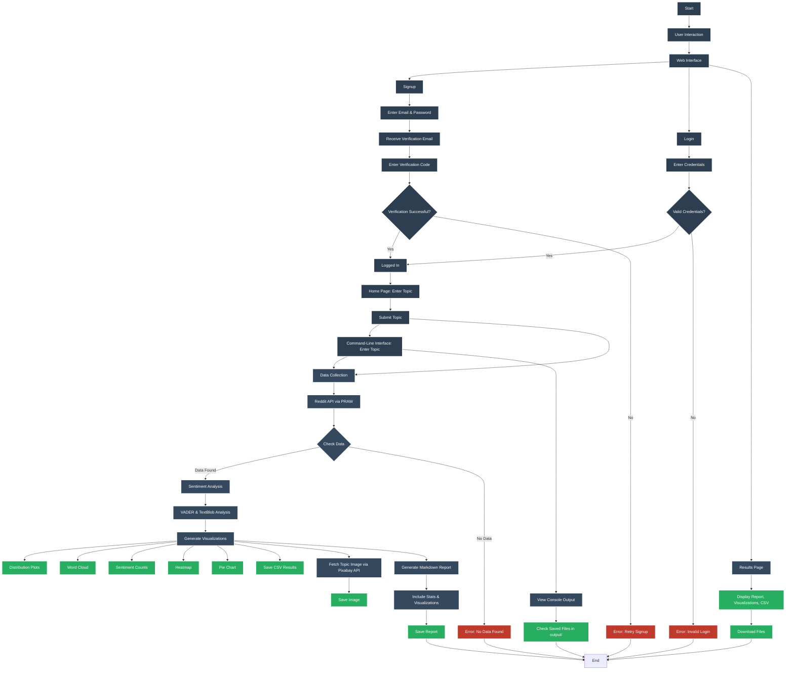

# Sentinent — Robust Reddit Sentiment Analyzer 

<table>
  <tr>
    <td></td>
    <td></td>
  </tr> 
  <tr>
    <td></td>
    <td></td>
  </tr>
</table>

> A Flask-based web application and CLI tool that collects Reddit posts and comments, runs sentiment analysis (VADER + TextBlob), produces visualizations and a markdown report, and serves outputs securely to authenticated users.


---

## Project Overview

This is a Flask-based web application designed to perform sentiment analysis on Reddit posts and comments for a given topic. The application collects data from Reddit using the PRAW library, analyzes sentiment using VADER and TextBlob, generates insightful visualizations (e.g., distribution plots, word clouds, heatmaps, pie charts), and produces a detailed markdown report. It includes user authentication with email verification, integrates with the Pixabay API for topic-related images, and provides a user-friendly web interface for interaction. The application is modular, secure, and designed for scalability, making it suitable for analyzing social media sentiment on various topics.

---

## Project Flow Chat

The Sentinent project is organized into two main sections: the output/ folder and the sentiment_flask_app/ folder. The output/ folder stores all the results generated by the application, including sentiment distribution plots, word clouds, sentiment count bar charts, markdown reports, CSV files of raw data, and topic-related images fetched from Pixabay. The sentiment_flask_app/ folder contains the core application logic and resources. It includes app.py, which is the main Flask application handling web routes; main.py, which provides a command-line interface for running the analysis without the web interface; config.py for managing configuration and environment variables; data_collector.py for collecting Reddit posts and comments using PRAW; sentiment_analyzer.py for performing sentiment analysis with VADER and TextBlob; visualization_generator.py for generating plots and word clouds; report_generator.py for creating markdown reports; and image_search_integration.py for fetching topic-related images via the Pixabay API. Additionally, the folder contains users.db for storing user credentials and the templates/ directory, which holds the HTML files for the web interface. Overall, this structure separates data outputs from application logic, making the project modular, organized, and easy to maintain.


## Key Features
- Secure user authentication with email verification (6-digit code).  
- Reddit data collection (posts + comments) via PRAW.  
- Combined sentiment scoring (VADER + TextBlob) and categorization (positive / neutral / negative).  
- Visualizations: distribution plots, bar charts, word cloud, heatmap, pie chart.  
- Markdown report generation with embedded visuals and statistics.  
- Topic image integration from Pixabay to enrich reports.  
- Outputs saved in `output/` (CSV, PNGs, `.md`) and downloadable for authenticated users.  
- CLI mode for headless operation.

---

## Prerequisites
- Python 10 or newer.  
- SQLite3 (for the shipped `users.db`).  
- Reddit API credentials (client id, client secret, user agent).  
- Pixabay API key (optional, recommended for topic images).  
- SMTP server credentials (for email verification—Gmail app password recommended).  
- Recommended packages in `requirements.txt`: Flask, praw, vaderSentiment, textblob, matplotlib, seaborn, wordcloud, pandas, numpy, python-dotenv, pillow, sqlalchemy (or sqlite3).

---


## ecurity Features

Password Hashing: Uses pbkdf2_sha256 for secure password storage.
Session Management: Persistent sessions with a 1-day lifetime and SameSite=Lax cookies.
Email Verification: Ensures only verified users can access the application.
Error Handling: Comprehensive logging and user-friendly error messages for API failures, SMTP issues, and more.

## Limitations
Reddit API rate limits may restrict data collection for high-volume topics.
Pixabay API requires a valid key and may not always return relevant images.
SMTP configuration requires a reliable email server; misconfiguration may prevent email verification.
The application assumes UTF-8 compatible text; non-standard encodings may cause issues.

## Future Improvements
Add support for other social media platforms (e.g., X API).
Implement real-time sentiment monitoring with a dashboard.
Enhance visualization interactivity using Plotly or Bokeh.
Add support for multiple languages in sentiment analysis.
Improve image search with additional APIs (e.g., Unsplash).

## Troubleshooting
Reddit API Errors: Ensure valid credentials in .env and check Reddit API status.
SMTP Issues: Verify SMTP server settings and ensure the email account allows less secure apps or has an app-specific password.
Visualization Failures: Ensure Matplotlib and Seaborn are correctly installed and the output/ directory is writable.
Database Issues: Check that users.db is not corrupted and SQLite3 is installed.


## Installation
1. Clone the repo:
```bash
git clone https://github.com/say217/SENTINENT.git
cd sentinent
```


```
├── output/
│   ├── Python_Programming_sentiment_plots.png
│   ├── Python_Programming_wordcloud.png
│   ├── Python_Programming_sentiment_counts.png
│   ├── Python_Programming_sentiment_report.md
│   ├── Python_Programming_sentiment_results.csv
├── sentiment_flask_app/
│   ├── users.db
│   ├── app.py
│   ├── main.py
│   ├── config.py
│   ├── data_collector.py
│   ├── sentiment_analyzer.py
│   ├── visualization_generator.py
│   ├── report_generator.py
│   ├── templates/
│   │   ├── index.html
│   │   ├── results.html
│   │   ├── login.html
│   │   ├── signup.html
│   ├── .env
```

## ## Contributing

Contributions to this project are always welcome! To contribute, first fork the repository to your own GitHub account. Next, create a feature branch using `git checkout -b feature/your-feature` and make the desired changes in your branch. Once your changes are ready, commit them with a descriptive message like `git commit -m "Add your feature"`, and then push the branch to your fork using `git push origin feature/your-feature`. Finally, open a pull request to the original repository, providing a clear description of the changes you made so they can be reviewed and merged.
